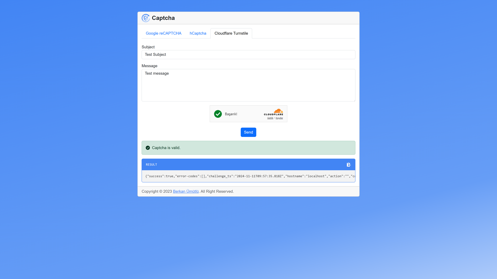

    

 

    
    
    
    <a href="https://www.php.net/releases/5_6_0.php" target="_blank" rel="nofollow">=v5.6-777BB4?logo=php&logoColor=white&labelColor=777BB4" alt="PHP Version"></a>
    
    
    

# PHP Captcha

It is a project that includes examples of how captcha verification processes are performed.

## Features

- [x] Google reCAPTCHA v2 ([documentation](https://developers.google.com/recaptcha/docs/display), [source code](https://github.com/berkanumutlu/php-captcha/pull/2))
- [x] hCaptcha ([documentation](https://docs.hcaptcha.com/), [source code](https://github.com/berkanumutlu/php-captcha/pull/3))
- [x] Cloudflare Turnstile ([documentation](https://developers.cloudflare.com/turnstile/), [source code](https://github.com/berkanumutlu/php-captcha/pull/4))

## Screenshots

- Google reCAPTCHA v2
  
- hCaptcha
  
- Cloudflare Turnstile
  

## License

The MIT License (MIT). Please see [License File](LICENSE) for more information.