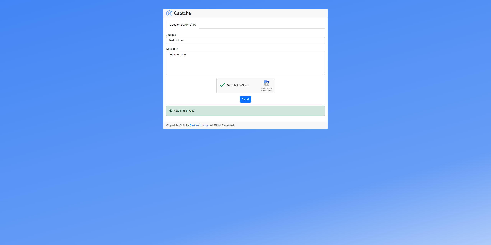
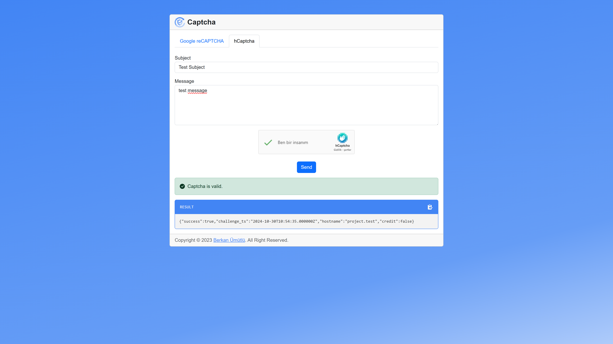

    

 

<a href="https://www.php.net/releases/5_6_0.php" target="_blank" rel="nofollow">=v5.6-777BB4?logo=php&logoColor=white&labelColor=777BB4" alt="PHP Version"></a>

# PHP Captcha

It is a project that includes examples of how captcha verification processes are performed.

## Screenshots

- Google reCAPTCHA

- hCaptcha

## License

The MIT License (MIT). Please see [License File](LICENSE) for more information.